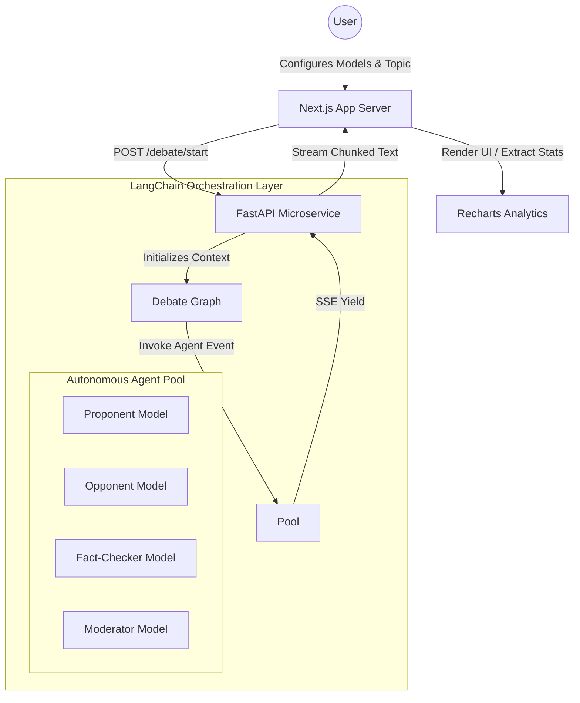

<div align="center">
  

  <h1>Nexus Debate System</h1>

  <p>
    <strong>A Sovereign Multi-Agent AI Argumentation Framework</strong>
  </p>

  <p>
    <a href="#features"></a>
    <a href="#tech-stack"></a>
    <a href="#tech-stack"></a>
    <a href="#tech-stack"></a>
  </p>

  <p>
    <em>Witness cutting-edge LLMs argue intelligently via real-time stream orchestration.</em>
  </p>

  <p>
    <a href="https://nexus-ai-debate-system.vercel.app/"><strong>Explore the Live Demo »</strong></a>
  </p>
</div>

---

## 📖 Overview

**Nexus Debate** is a sophisticated, full-stack multi-agent AI argumentation platform. It automatically orchestrates a directed acyclic graph of AI agents—pitching opposing models against each other over complex subjects—all governed by a neutral **Moderator** and an objective **Fact-Checker**.

Built with an unapologetic focus on extreme **UI polish**, **real-time capability**, and **scalable intelligence**, Nexus showcases exactly how microservices and LLMs can merge to produce highly autonomous, emergent reasoning.

---

## ⚡ Core Features

- 🧠 **Dynamic Orchestration Engine**: Built on LangChain and Python, controlling 4 specialized AI roles: `Proponent`, `Opponent`, `Fact-Checker`, and `Moderator`.
- ⚡ **Real-Time Data Streaming**: Entire debates are streamed live to the client utilizing `Server-Sent Events (SSE)` Starlette protocols, eradicating LLM generation latency.
- 🎨 **Hyper-Premium UI/UX**: Constructed with raw Tailwind CSS and Framer Motion. Features advanced glassmorphism, dynamic glow states, interactive micro-animations, and a responsive dark-mode cyber aesthetic.
- 📊 **Live Analytics & Scoring**: The Moderator calculates debate strength sequentially, pumping data into a dynamic time-series performance visualizer handled by Recharts.
- 🔌 **Model Agnostic Infrastructure**: Instantly hot-swap underlying reasoning engines between **OpenAI (GPT-4o)**, **Google (Gemini 2.0)**, and **Groq (Llama 3/Mixtral)**.

---

## 🏗️ Technical Architecture

Nexus separates concerns entirely via a hardened API boundary, utilizing Next.js for client delivery and FastAPI for heavy AI processing.



---

## 🛠️ Technology Stack

### **Frontend Client**
* **Framework**: React 19 + Next.js 15 (App Router)
* **Styling**: Tailwind CSS + `lucide-react` icons
* **Animations**: Framer Motion
* **Visualizer**: Recharts

### **Backend Server**
* **Framework**: FastAPI (Python 3.9+)
* **AI Orchestration**: LangChain Base
* **Connections**: HTTP / Server-Sent Events (SSE)
* **API Handlers**: `sse_starlette`

---

## 🏎️ Getting Started

### 1. Backend Service Launch
The engine powering the AI requests must be initialized first.
```bash
cd backend

# Build virtual environment
python3 -m venv venv
source venv/bin/activate

# Install dense python dependencies
pip install -r requirements.txt

# Secure configuration
cp .env.example .env
# Edit .env and supply your OPENAI_API_KEY, GROQ_API_KEY, or GEMINI_API_KEY

# Launch FastAPI Server
python main.py
```

### 2. Frontend Client Delivery
Open a new terminal to start the development server for the UI.
```bash
cd frontend

# Install node modules
npm install

# Build and start development portal
npm run dev
```
🟢 Navigate to [http://localhost:3000](http://localhost:3000) to enter the Arena.

---

## 🧠 System Workflow

1. **Parameter Calibration**: Users access the Configuration Sidebar, dynamically binding distinct LLMs to specific debate roles (e.g., *Gemini* argues **for** Universal Basic Income, while *Llama 3* argues **against** it).
2. **The Exchange**: 
   - The **Proponent** streams a structured argument.
   - The **Opponent** ingests the history and fires back a logical rebuttal.
   - The **Fact-Checker** invisibly checks claims against its distinct truth-logic prompt layer.
3. **Synthesis & Metric Yield**: The **Moderator** extracts logic signals from both sides, scoring them 1-10.
4. **Client Render**: The Next.js frontend catches the streamed values via Regex, dynamically injecting text into the glassy chat bubbles and appending integer scores to the live-charting interface.

---

## 💡 Engineering Highlights

This repository emphasizes high-tier architectural decisions designed for scalable performance and maintainability:
- **Streaming over REST**: Overcoming timeout boundaries and improving perceived latency through standard Unix SSE protocols instead of heavy Websockets.
- **Isolating Intelligence**: Deep decoupling of the prompt engineering and LangChain graph logic inside `backend/agents/debate_engine.py`.
- **Advanced State Management**: Leveraging complex `useRef` and functional React arrays `useState<Message[]>` for asynchronous, race-condition-free UI rendering.

Built with passion and an eye for modern design.

---

<div align="center">
    <p>Licensed under <b>MIT</b>.</p>
</div>
