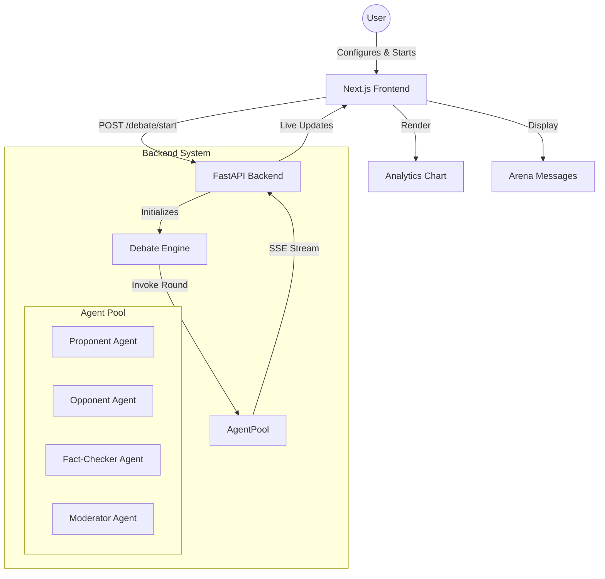

# AI Debate System (Nexus Debate)

Nexus Debate is a sophisticated, multi-agent AI argumentation platform. It pits two opposing AI agents against each other on a given topic, supervised by an AI Moderator and a real-time Fact-Checker.

## 🚀 Features

- **Multi-Agent Architecture**: Proponent, Opponent, Moderator, and Fact-Checker roles.
- **Dynamic LLM Engine**: Supports OpenAI, Gemini, and Groq (Llama 3/Mixtral) seamlessly.
- **Real-time Arena**: Watch arguments unfold in a live-streaming, turn-based environment.
- **AI-Powered Analytics**: Real-time scoring of argument strength with interactive charts.
- **Fact-Checking Layer**: Background verification of claims made during the debate.
- **Premium UI**: Modern dark-mode aesthetic with glassmorphism and smooth micro-animations.

## 🏗️ Architecture



## 🛠️ Tech Stack

- **Frontend**: Next.js 14, TypeScript, Tailwind CSS, shadcn/ui, Framer Motion, Recharts.
- **Backend**: Python 3.9+, FastAPI, LangChain, LangGraph, Pydantic.
- **AI Models**: OpenAI (GPT-4), Google (Gemini 1.5), Groq (Llama 3).

## 📋 Prerequisites

- Node.js 20+
- Python 3.9+
- API Keys for OpenAI, Google AI, and/or Groq.

## 🏃 Setup Instructions

### 1. Backend Setup

```bash
cd backend
python3 -m venv venv
source venv/bin/activate
pip install -r requirements.txt
cp .env.example .env
# Edit .env and add your API keys
python main.py
```

### 2. Frontend Setup

```bash
cd frontend
npm install
npm run dev
```

Open [http://localhost:3000](http://localhost:3000) to view the application.

## 🧠 Workflow Explanation

1. **Initialization**: The user sets a topic, number of rounds, and chooses which LLMs will power each agent.
2. **The Battle**:
   - **Proponent**: Opens with a strong "FOR" argument.
   - **Opponent**: Responds with a logical "AGAINST" rebuttal.
   - **Fact-Checker**: Analyzes the recent exchange for inaccuracies.
   - **Moderator**: Summarizes the round and assigns scores to both sides.
3. **Analytics**: The scores are parsed and plotted on a live line chart to show the "tide of battle."
4. **Completion**: A final summary and average score determine the winner of the nexus debate.

## 📄 License

MIT
